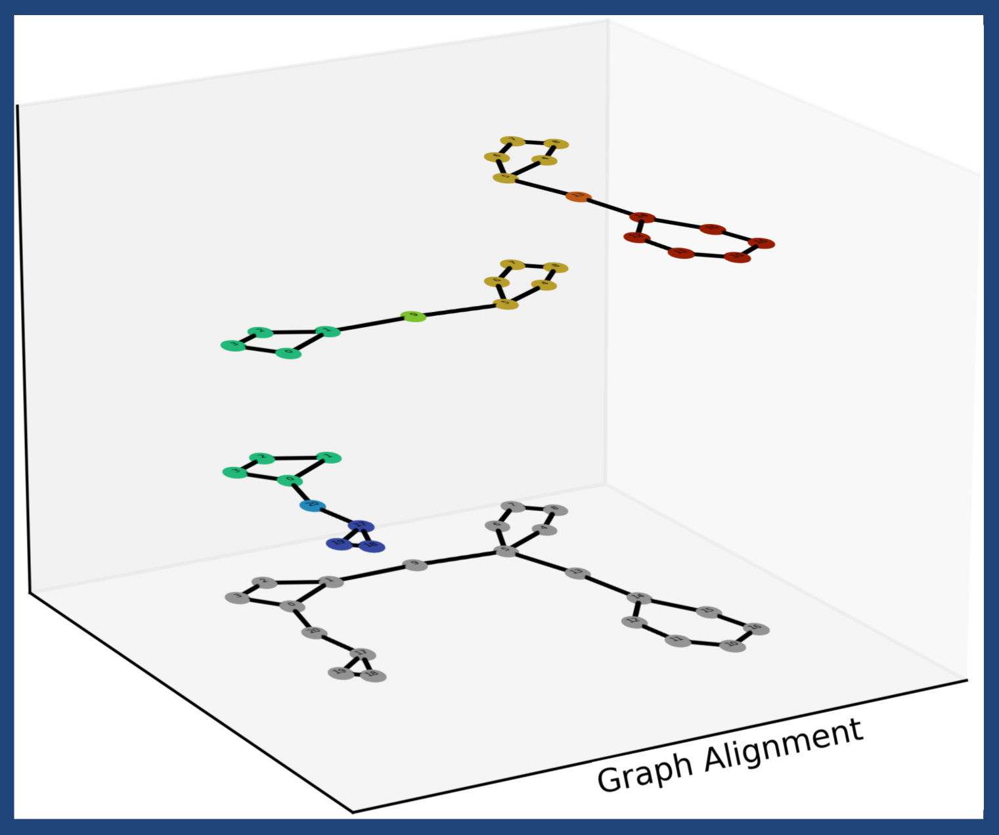
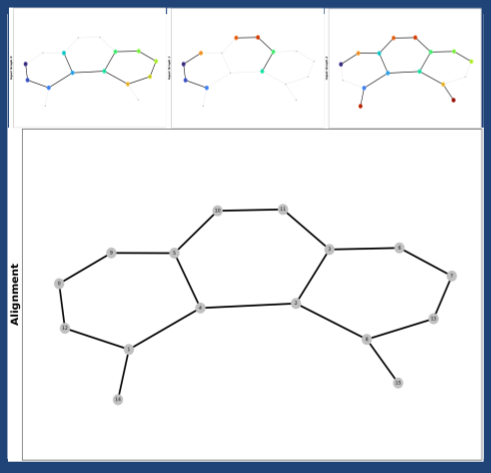
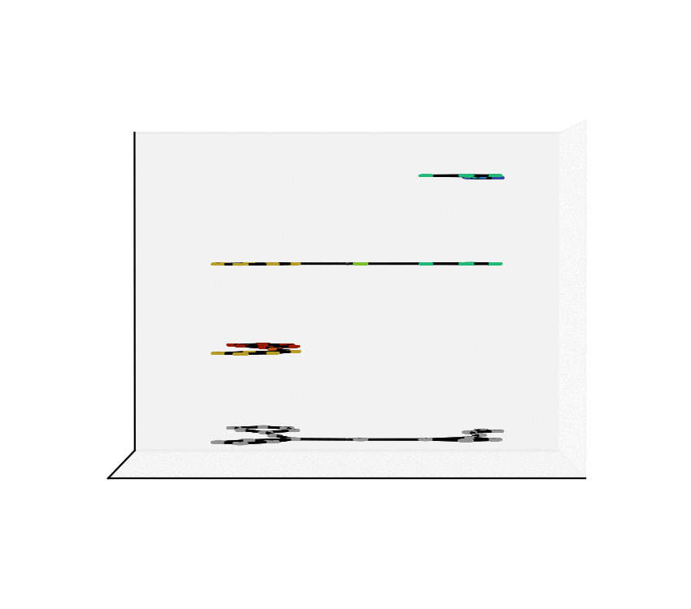
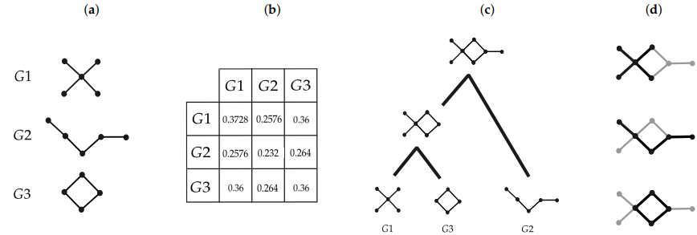

# Progralign - Welcome to the Repo

<p align="center">
  
<br/>
Proof of Concept for Construction and Visualization of
<br/>
<strong>Pro</strong>gressive <strong>Gra</strong>ph <strong>Align</strong>ments
</p>


## Institutions

> Center for Scalable Data Analytics and Artificial Intelligence, Leipzig / Dresden, Germany. See <a href="https://scads.ai/">ScaDS.AI</a>.<br/>

> Bioinformatics Group, Department of Computer Science, Leipzig University, Germany. See <a href="https://www.bioinf.uni-leipzig.de/">Bioinf</a>.<br/>

> Interdisciplinary Center for Bioinformatics, Leipzig University, Germany. See <a href="https://www.izbi.uni-leipzig.de/">IZBI</a>.<br/>


<p align="center">

</p>


## Developed by

- Marcos E. González Laffitte<br/>
  Bioinformatics Group and ScaDS.AI, Leipzig University<br/>
  marcoslaffitte@gmail.com<br/>
  marcos@bioinf.uni-leipzig.de<br/>

- Prof. Dr. Peter F. Stadler<br/>
  Bioinformatics Group and ScaDS.AI and Interdisciplinary Center for Bioinformatics, Leipzig University<br/>
  studla@bioinf.uni-leipzig.de<br/>


## Description

<div align="justify">
The formal alignment of graphs and other mathematical objects was initially proposed in <a href="https://link.springer.com/article/10.1007/s11786-020-00496-8">[2]</a></strong> and <a href="https://royalsocietypublishing.org/doi/10.1098/rsfs.2020.0066">[3]</a></strong>. Here we provide a self-contained pipeline working as a proof of concept for the construction and visualization of graph alignmnets as described in <strong>[1]</strong>. This consists of three main tools: <a href="./Progralign_Analysis">Progralign_Analysis</a> that receives a Python list of NetworkX graphs saved in a pickle file and carries the progressive alignment of these graphs. Then the output file of Progralign_Analysis can be used by <a href="./Progralign_Vis2D">Progralign_Vis2D</a> to obtain pdf files with the visual description of the alignment objects. Similarly, <a href="./Progralign_Vis3D">Progralign_Vis3D</a> can receive the output of Progralign_Vis2D to produce 3D plots and animations (as the one above) of the alignments. Moreover, if you don't have yet a list of NetworkX graphs we provide the script <a href="./CreatorTool">CreatorTool</a> that contains examples on how to build these objects with Python. More information on NetworkX can be found in <a href="https://networkx.org/">[4]</a></strong>.
</p>
<br/>

**Note:** the graphs shown in the examples are planar, but in general these don't need to be so. These can be all type of graphs, be it directed, undirected, labeled or unlabeled and with or without loops. Find more information on the following reference.


## Cite as

This repository was developed as part of the contribution:

**[1]** González Laffitte, M.E.; Stadler, P.F. Progressive Multiple Alignment of Graphs. Algorithms 2024, 17, 116.
> **Link:** https://www.mdpi.com/1999-4893/17/3/116


<div align="justify">
There you can find detailed information on the algorithms implemented here. This work was developed for research purposes. Please cite as above if you find this work or these programs useful for your own research.
</div>
<br/>

<p align="center">

</p>
<div align="center">
<strong>Overview of the progressive alignment carried by ProGrAlign <a href="https://www.mdpi.com/1999-4893/17/3/116">[1]</a></strong><br/>
</div>


## Instructions

###### In order to run these programs you will require some python packages, below we show how to install them directly into an anaconda environment. After this you should be able to run the pipeline CreatorTool > Progralign_Analysis > Progralign_Vis2D > Progralign_Vis3D, meaning that the output of one program is the input for the following. Below you can also find the python commands to run each program.


### Create Anaconda Environment
###### 1) Create the pgalign environment while adding some of the required dependencies:
```
conda create -n pgalign python=3.10.12 networkx=2.8.4 matplotlib=3.5.2 numpy=1.25.2
```
###### 2) Then activate the pgaling environment so you can run the scripts:
```
conda activate pgalign
```
###### 3) Finally install one last dependency with pip inside the pgalign conda environment:
```
pip install graphkit-learn==0.2.1
```


###### Remember to always activate the pgalign conda environment before using the programs in this repository. Note that these scripts make use of Pickle, a standard Python library used for saving Python objects into binary files simplifying the exchange and reuse of information. In particular we use the version of Pickle that comes already with the installation of Python 3.10, which should be Pickle 4.0. Please find <a href="https://docs.python.org/3.10/library/pickle.html">here</a></strong> more information on Pickle, and only unpickle files that you trust :)


### Run CreatorTool
###### If you currently don't have a list of NetworkX graphs, then you can create one with this tool. Note that the graphs should be created in-code based on your reasearch interests. If you already obtained the graphs in some other way then you can skip this program. In that case you simply need to save your graphs in a list and then pickle the list so it can be given to Progralign_Analysis as below. Otherwise run CreatorTool as follows:

```
python  CreatorTool.py
```
###### The output will be a pickle file [myFile.pkl] containing a list of NetworkX graphs. See <a href="./CreatorTool">CreatorTool</a> for an example.<br/>


### Run Progralign_Analysis
###### If you already have a pickle file [myFile.pkl] containing a list of NetworkX graphs, then you can align them with:
```
python  Progralign_Analysis.py  [myFile.pkl]
```
###### The output will be another pickle file [myFile_Results.pkl] containing a python dictionary that holds all the data from the alignment process. See <a href="./Progralign_Analysis">Progralign_Analysis</a> for an example. This program carries a maximum-common-induced-subgraph search using an iterative trimming algorithm by default, see [1]. If instead you wish to use the recursive expansion algorithm (VF2_step in [1]), please run it with the --expand option as follows:
```
python  Progralign_Analysis.py --expand  [myFile.pkl]
```


### Run Progralign_Vis2D
###### If you wish to produce PDF files with plots of the alignment objects you can make use of our 2D visualization tool. To do so give the file [myFile_Results.pkl] produced by Progralign_Analysis to Progralign_Vis2D as follows:
```
python  Progralign_Vis2D.py  [myFile_Results.pkl]
```
###### Now the output will consist on two pdf files [myFile_1D_plot.pdf] and [myFile_2D_plot.pdf] showing, respectively, the matrix representation of the alignment, and plots of the input and alignment graphs. Find an example in <a href="./Progralign_Vis2D">Progralign_Vis2D</a>. Also if the number of input graphs is below a predefined threshold (5 graphs, can be changed in-code), then a last pickle file [myFile_Results_3D_data.pkl] will be produced so that with this we can make 3D plots and animations of the alignment using the following tool.

###### NOTE: producing the 3D plots and 3D animations is more time consuming than producing the 2D plots. Thus the 3D plots produced with the following tool are made by stacking the 2D plots that are the output of Progralign_Vis2D. This is done in this way so that you can have a preliminary view on how the 3D plots will come to look-like before investing time on them.


### Run Progralign_Vis3D
###### If you already made the 2D plots and like how they look then you can run this tool to stack them into a 3D plot. There are two options to run this tool, one that only makes 3D plots, and the other that besides the 3D plots also makes two 3D animations. To produce only the 3D plots run:
```
python  Progralign_Vis3D.py  [myFile_Results_3D_data.pkl]
```
###### The 3D plots will be produced in PNG format so that they are light-weighted. In order to also produce two GIF files with 3D animations of the alignment, then run instead:
```
python  Progralign_Vis3D.py  --anim  [myFile_Results_3D_data.pkl]
```
###### Find an example inside <a href="./Progralign_Vis3D">Progralign_Vis3D</a>.


### Deactivate or Remove Anaconda Environment
###### Finally you can deactivate the pgalign environment after using it:
```
conda deactivate
```
###### or remove it if not needed anymore:
```
conda env remove -n pgalign
```


## Additional Information

For the theory of graph alignments, alignments of other mathematical objects, and more applications of alignments see the two following references:


**[2]** <strong>Compositional Properties of Alignments.</strong>
<br/>
Berkemer, Sarah J, et al.
<br/>
Mathematics in Computer Science. 2021.
> **Link:** https://link.springer.com/article/10.1007/s11786-020-00496-8


**[3]** <strong>Alignments of biomolecular contact maps.</strong>
<br/>
Peter F. Stadler
<br/>
Interface Focus. 2021.
> **Link:** https://royalsocietypublishing.org/doi/10.1098/rsfs.2020.0066


For information on NetworkX see:

**[4]** <strong>NetworkX: Network Analysis in Python.</strong>
> **Link:** https://networkx.org/


## LICENSE

The programs in this repository are part of the work published in <br/>
https://www.mdpi.com/1999-4893/17/3/116<br/>
and are released under<br/>
<strong>MIT License Copyright (c) 2023 Marcos E. González Laffitte</strong><br/>
See <a href="./LICENSE">LICENSE</a> file for full license details.